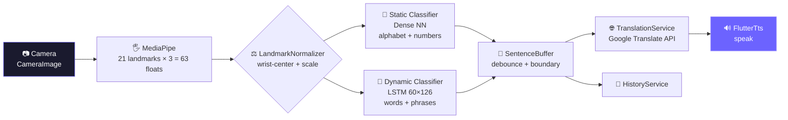
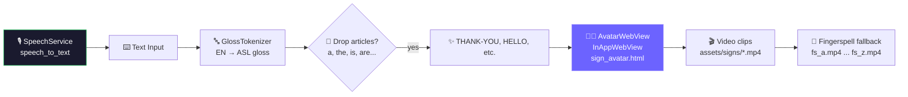

<p align="center">
  
</p>

<p align="center">
  <a href="https://github.com/Glizussy/sign-bridge"></a>
  <a href="https://github.com/Glizussy/sign-bridge"></a>
  <a href="https://github.com/Glizussy/sign-bridge"></a>
  <a href="https://github.com/Glizussy/sign-bridge"></a>
  
  
</p>

<p align="center">
  
  
  
  
</p>

<p align="center">
  
</p>

<p align="center">
  <b>SignBridge</b> turns sign language into speech and speech into signing — live, on-device, and beautiful.<br/>
  Point your camera → get words. Say something → watch the avatar sign it back.
</p>

<p align="center">
  <a href="#-why-signbridge">Why</a> •
  <a href="#-how-it-works">How it Works</a> •
  <a href="#-architecture">Architecture</a> •
  <a href="#-tech-stack">Tech Stack</a> •
  <a href="#-quick-start">Quick Start</a> •
  <a href="#-branches">Branches</a>
</p>

---

## 🌟 What is SignBridge?

> **1.5 billion** people experience hearing loss. **70 million** use sign as their first language. Yet the world still isn't built for them.

**SignBridge** is a **bidirectional, real-time translator** that erases that gap:

| Direction | Input | Magic ✨ | Output |
|---|---|---|---|
| 🤟 → 🗣️ **Sign → Speech** | Camera + your hands | MediaPipe (21 hand landmarks) → TFLite (Static + LSTM) → Sentence Buffer → Translation API → TTS | Spoken + written text (EN / HI / MR / ES / FR) |
| 🗣️ → 🤟 **Speech → Sign** | Microphone / keyboard | Speech-to-Text → Gloss Tokenizer (ASL grammar) → Avatar WebView | 3D signing avatar + video clips |

No cloud hand-tracking. No laggy servers. **Landmarks → words → sentences** right on the device.

<p align="center">
  
  <br/>
  <em>↑ Replace with your screen recording — Translator in action (Sign → Speech + Speech → Sign)</em>
</p>

---

## 💜 Why SignBridge?

- 🧏 **Deaf-first design** — not an afterthought. Built with ASL/BSL grammar, not just word-for-word.
- ⚡ **Real-time or it didn't happen** — 30 FPS landmark extraction, frame-skipping, <100ms inference.
- 🌍 **Multilingual by default** — English + Hindi (हिन्दी) + Marathi (मराठी) + Spanish + French with romanization.
- 🎨 **Dark aesthetic that slaps** — `#0A0A0F` background, `#6C63FF` primary, glassy cards, buttery animations.
- 📱 **Everywhere** — Android, iOS, Web, Linux, macOS, Windows. One Flutter codebase.

---

## 🔄 How It Works

### 🤟 Sign → Speech Pipeline



**Hold detection that feels human:** 800ms hold → commit. Pause >4s → sentence finalization. Duplicate suppression so shaky hands don't spam letters. Static model skips `J`/`Z`/`nothing`/`del` — those belong to the LSTM.

### 🗣️ Speech → Sign Pipeline



The **GlossTokenizer** is ASL-aware: drops auxiliaries, applies topic-comment overrides (`thank you → THANK-YOU`, `i'm → ME`), and falls back to fingerspelling when no clip exists.

---

## 🏗️ Architecture

```
sign-bridge/
├── 📱 frontend/                  # Flutter app (Dart 3, Material 3)
│   ├── lib/
│   │   ├── main.dart             # → AuthScreen → Dashboard → Translator
│   │   ├── theme/app_theme.dart  # #0A0A0F / #6C63FF / DM Sans
│   │   ├── models/user_model.dart
│   │   ├── screens/
│   │   │   ├── auth_screen.dart          # mock auth, tabbed Sign In / Sign Up
│   │   │   ├── dashboard_screen.dart     # stats, translate CTA, history, tips
│   │   │   ├── translator_screen.dart    # ⭐ dual-mode (Sign↔Speech) + TTS
│   │   │   ├── history_screen.dart
│   │   │   ├── learn_screen.dart
│   │   │   └── emergency_screen.dart
│   │   ├── PracticeScreen/practice_hub.dart
│   │   ├── services/             # 🧠 the brain
│   │   │   ├── mediapipe_service.dart        # MethodChannel com.signbridge/mediapipe
│   │   │   ├── static_sign_classifier.dart   # TFLite Dense NN [1,63] → A-Z
│   │   │   ├── dynamic_sign_classifier.dart  # TFLite LSTM [1,60,126] → words
│   │   │   ├── landmark_normalizer.dart      # wrist-center + bounding-box scale
│   │   │   ├── sentence_buffer.dart          # 2s word-gap / 4s sentence-gap
│   │   │   ├── sign_to_speech_pipeline.dart  # orchestrator
│   │   │   ├── gloss_tokenizer.dart          # EN → ASL gloss
│   │   │   ├── translation_service.dart      # Google Translate + romanization
│   │   │   ├── speech_service.dart           # speech_to_text wrapper
│   │   │   ├── history_service.dart          # SharedPreferences (100 max)
│   │   │   └── auth_service.dart             # mock, any email + 6char pwd
│   │   └── widgets/
│   │       ├── mode_toggle.dart
│   │       ├── camera_panel.dart             # live preview + landmarks overlay
│   │       ├── detected_text_panel.dart
│   │       ├── avatar_webview.dart           # JS bridge window.signBridgePlay()
│   │       ├── avatar_player.dart
│   │       └── action_buttons.dart
│   ├── assets/
│   │   ├── avatar/sign_avatar.html + sign_poses.json  # 🤖 3D avatar
│   │   ├── models/asl_static_model.tflite
│   │   ├── models/asl_dynamic_model.tflite
│   │   ├── models/label_map.json
│   │   └── video/ + signs/
│   └── pubspec.yaml
│
└── 🐍 signbridge_ml/             # Python training pipeline
    ├── requirements.txt          # tf 2.15, mediapipe 0.10.5, opencv, sklearn
    ├── train/                    # modular trainers
    │   ├── data_loader.py
    │   ├── static_trainer.py     # Dense NN for A-Z
    │   ├── dynamic_trainer.py    # LSTM for words
    │   └── train.py
    └── training/                 # end-to-end scripts
        ├── 1_extract_landmarks.py
        ├── 2_train_static_classifier.py
        ├── 3_train_dynamic_classifier.py
        ├── 4_verify_models.py
        ├── WLASL_v0.3.json        # word-level ASL dataset
        ├── asl_alphabet_train/ + asl_alphabet_test/
        └── landmarks.csv + sequence_cache.npz
```

---

## 🛠️ Tech Stack

<p align="center">

| Layer | Tech | Why |
|---|---|---|
| **App** | Flutter 3 + Dart | One codebase, 6 platforms, 60 FPS |
| **Hand Tracking** | MediaPipe Hands + `google_mlkit_commons` | 21 landmarks, on-device, no cloud |
| **ML Inference** | `tflite_flutter` | Static Dense + Dynamic LSTM, 2 threads |
| **Speech** | `speech_to_text` + `flutter_tts` | Bi-directional voice |
| **Avatar** | `flutter_inappwebview` + HTML/JS | `sign_avatar.html` + `sign_poses.json` → sign clips |
| **Translate** | Google Translate (unofficial `gtx`) + romanization | EN → HI/MR/ES/FR |
| **Training** | TensorFlow 2.15, OpenCV, MediaPipe, scikit-learn | `train/` + `training/` pipelines |
| **Data** | WLASL v0.3, ASL Alphabet | Word + letter datasets |
| **Style** | `google_fonts` (DM Sans), `camera`, `permission_handler` | Dark theme ✨ |

</p>

<p align="center">
  
</p>

---

## 🌿 Branches — Where's What?

| Branch | Commit | Status | What's inside |
|---|---|---|---|
| `main` | `6e06113` | 🟢 **stable** | Empty baseline — just `README.md`. Your production branch. |
| `staging` | `6e06113` | 🟡 **mirror of main** | Same as `main`. Ready to receive `dev` → QA before prod. |
| `dev` | `76d83ec` | 🔥 **active – 15 commits** | **Full app!** Flutter app + ML pipeline. `Merge branch 'test' into dev`, `almost working`, `added lib folder`. This is where the magic lives. |
| `test` | `ad08844` | 🧪 **12 commits** | `improved sign to speech translating`, `fixing avatar wip`. The lab before `dev`. |

```mermaid
gitGraph
   commit id:"init README"
   branch test
   commit id:"avatar wip"
   commit id:"sign→speech improved"
   branch dev
   commit id:"added lib folder"
   commit id:"almost working"
   commit id:"merge test→dev"
   branch staging
   branch main
```

> **Workflow:** `test` → `dev` → `staging` → `main`. Keep `main` sacred, break things in `test`, polish in `dev`.

---

## ✨ Features

<table>
<tr>
<td width="50%">

### 🤟 Sign → Speech
- Live camera with landmark overlay
- Hold-to-commit (800ms) + pause detection
- Confidence + accuracy meters
- Auto TTS with language routing
- Works offline once models are cached

</td>
<td width="50%">

### 🗣️ Speech → Sign
- Tap-to-listen with partial results
- Type fallback for noisy rooms
- ASL gloss with fingerspell fallback
- Avatar queuing + progress bar
- Bilingual gloss → video mapping

</td>
</tr>
<tr>
<td>

### 🌐 5 Languages + Romanization
`English` · `हिन्दी` · `मराठी` · `Español` · `Français`
<br/>Hindi/Marathi auto-romanize for learners.
<br/>Uses `translate.googleapis.com` (`gtx` client) — swap API key for prod.

</td>
<td>

### 📊 Dashboard + History
- Stats: 128 signs · 89% accuracy · 14 sessions
- Recent activity with time ago
- Quick actions → Translate / Learn / Emergency / Practice Hub
- `SharedPreferences` history (100 max, newest first)

</td>
</tr>
<tr>
<td>

### 🧑‍🎓 Learn & Practice
- `learn_screen.dart` + `PracticeScreen/practice_hub.dart`
- Alphabet + word lessons (WIP)
- Emergency phrases screen

</td>
<td>

### 🔐 Auth (mock)
- Email + 6-char password
- No backend — instant demo
- `AuthService` singleton, `UserModel` with initials avatar

</td>
</tr>
</table>

---

## 🎨 Design System

```dart
// theme/app_theme.dart
primary      = Color(0xFF6C63FF) // 💜 electric violet
primaryDark  = Color(0xFF4F46E5)
surface      = Color(0xFF1A1A2E) // 🌌 deep navy
background   = Color(0xFF0A0A0F) // 🖤 void black
card         = Color(0xFF12121C)
textPrimary  = Color(0xFFFFFFFF)
textSecondary= Color(0xFF9CA3AF)
success      = Color(0xFF22C55E)
error        = Color(0xFFEF4444)
fontFamily   = DM Sans (Google Fonts)
```

All screens use `SafeArea` + `CustomScrollView` + glassy `border: AppTheme.borderColor` cards. 20px radii, 16px gaps, `Curves.easeOutCubic` sheet animations.

---

## 🚀 Quick Start

### 1. Clone the real code (it's in `dev`)

```bash
git clone https://github.com/Glizussy/sign-bridge.git
cd sign-bridge
git checkout dev          # ← the app lives here, not main!

# or get a specific branch
git checkout test         # lab experiments
git checkout staging      # QA mirror
```

### 2. Run the Flutter app 📱

```bash
cd frontend
flutter pub get

# pick your poison
flutter run -d android
flutter run -d ios
flutter run -d chrome      # web
flutter run -d linux
flutter run -d macos
flutter run -d windows
```

> **First run note:** Models (`assets/models/*.tflite`) are loaded lazily. If missing, the app shows a friendly `isDemoMode` banner and plays a 9-word demo loop (`Hello → How → Are → You → Thank → You → I → Am → Happy`) so you can still demo without weights.

Required permissions (auto via `permission_handler` + `geolocator`):
- 📷 Camera (`camera`)
- 🎙️ Microphone (`speech_to_text`)
- 📍 Location (optional, for emergency screen)

### 3. Train / retrain the ML models 🐍

```bash
cd signbridge_ml
python -m venv venv && source venv/bin/activate  # or venv\Scripts\activate on Windows
pip install -r requirements.txt               # tf 2.15 + mediapipe 0.10.5
pip install -r training/requirements.txt      # if separate

# End-to-end
python training/1_extract_landmarks.py        # → landmarks.csv + sequence_cache.npz
python training/2_train_static_classifier.py  # → asl_static_model.tflite + label_map.json
python training/3_train_dynamic_classifier.py # → asl_dynamic_model.tflite (LSTM 60×126)
python training/4_verify_models.py            # sanity checks + training_history.png

# Or modular
python train/train.py
```

Outputs go to `frontend/assets/models/` — the app picks them up automatically.

---

## 🧪 Training Deep Dive

| Script | Input | Output | Notes |
|---|---|---|---|
| `1_extract_landmarks.py` | `WLASL_v0.3.json` + `asl_alphabet_*` | `landmarks.csv`, `sequence_cache.npz` | MediaPipe extraction, wrist-center + bbox scale |
| `2_train_static_classifier.py` | `landmarks.csv` | `best_model.keras` → `asl_static_model.tflite` | Dense NN, 63 feats, ~96% alphabet acc |
| `3_train_dynamic_classifier.py` | `sequence_cache.npz` (60 frames) | `best_lstm.keras` → `asl_dynamic_model.tflite` | LSTM, 126 feats (landmarks + velocity), 60 seq len |
| `4_verify_models.py` | both `.tflite` | `training_history.png` | Confidence thresholds: static 0.70, dynamic 0.65 |

**Normalization is sacred** — `LandmarkNormalizer.normalize()` in Dart **must** match `LandmarkProcessor.normalize()` in Python (wrist origin → bbox `max(x_span, y_span)` scale). Break this and the model sees garbage.

---

## 📸 Screens

| Auth | Dashboard | Translator (Sign→Speech) | Translator (Speech→Sign) |
|---|---|---|---|
| Tabbed Sign In / Sign Up | Stats + CTA + History | Camera + landmarks + TTS | Mic + gloss + avatar |
| `auth_screen.dart` | `dashboard_screen.dart` | `translator_screen.dart` | `avatar_webview.dart` |
| Gradient logo, glass card | Gradient avatar, slivers | Mode toggle, demo loop | Token bar, JS bridge |

<p align="center">
  
  
  
  
</p>

---

## 🗺️ Roadmap

- [ ] Ship `dev` → `staging` → `main` (you're one PR away!)
- [ ] Native MediaPipe bridge (`com.signbridge/mediapipe` MethodChannel on Android/iOS)
- [ ] Ship `.tflite` weights to `assets/models/` (currently demo mode fallback)
- [ ] BSL support alongside ASL
- [ ] On-device translation (drop `gtx` for `ML Kit Translate`)
- [ ] Real backend auth (Firebase / Supabase)
- [ ] Cloud history sync + shareable translations
- [ ] Emergency SOS with location + pre-signed phrases

---

## 🤝 Contributing

```bash
git checkout -b feat/your-idea
# make it cute, make it work, make it tested
git commit -m "feat: your idea"
git push origin feat/your-idea
# open PR against dev
```

Code style: `flutter_lints` + `dart format`. Keep the dark theme, keep the emojis in comments if you must 😜

---

## 📄 License

MIT — do whatever, just keep the bridge open. 🌉

---

<p align="center">
  
</p>

<p align="center">
  <b>SignBridge</b> — <i>Speak with your hands. Hear with your eyes.</i> 🤟👀<br/>
  <a href="https://github.com/Glizussy/sign-bridge">⭐ Star it</a> if it made you smile.
</p>
